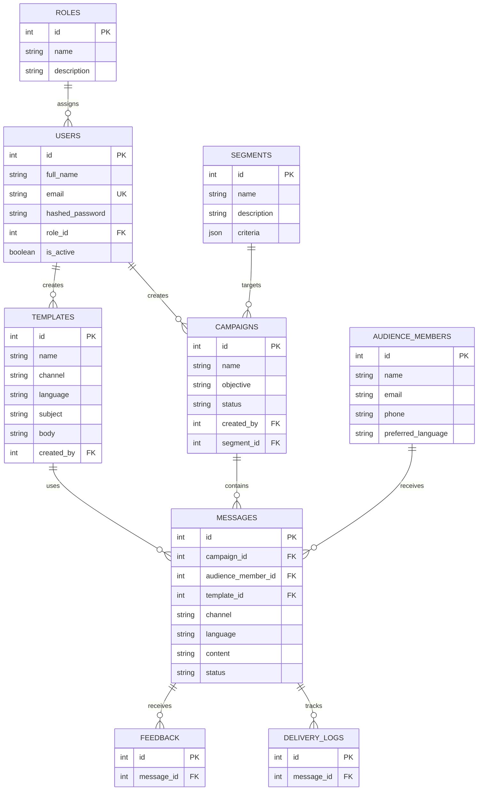

# NexaReach — Entity Relationship Diagram

```mermaid
erDiagram
    ROLES ||--o{ USERS : assigns
    USERS ||--o{ CAMPAIGNS : creates
    USERS ||--o{ TEMPLATES : creates
    SEGMENTS ||--o{ CAMPAIGNS : targets
    CAMPAIGNS ||--o{ MESSAGES : contains
    AUDIENCE_MEMBERS ||--o{ MESSAGES : receives
    TEMPLATES ||--o{ MESSAGES : uses
    MESSAGES ||--o{ DELIVERY_LOGS : tracks
    MESSAGES ||--o{ FEEDBACK : receives

    ROLES {
        int id PK
        string name
        string description
    }

    USERS {
        int id PK
        string full_name
        string email UK
        string hashed_password
        int role_id FK
        boolean is_active
    }

    AUDIENCE_MEMBERS {
        int id PK
        string name
        string email
        string phone
        string preferred_language
    }

    SEGMENTS {
        int id PK
        string name
        string description
        json criteria
    }

    CAMPAIGNS {
        int id PK
        string name
        string objective
        string status
        int created_by FK
        int segment_id FK
    }

    TEMPLATES {
        int id PK
        string name
        string channel
        string language
        string subject
        string body
        int created_by FK
    }

    MESSAGES {
        int id PK
        int campaign_id FK
        int audience_member_id FK
        int template_id FK
        string channel
        string language
        string content
        string status
    }

    DELIVERY_LOGS {
        int id PK
        int message_id FK
    }

    FEEDBACK {
        int id PK
        int message_id FK
    }
```
